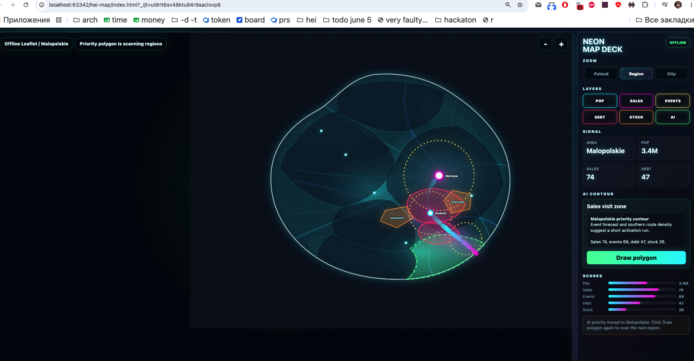
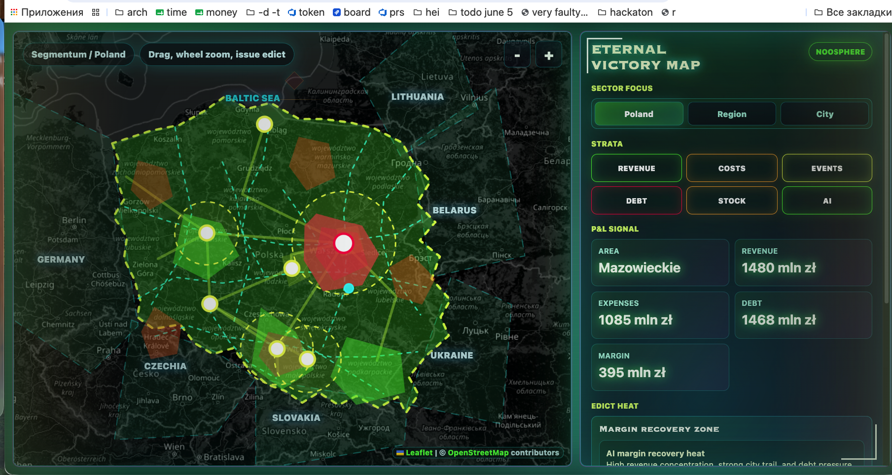
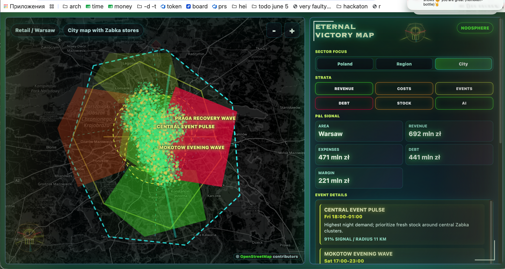
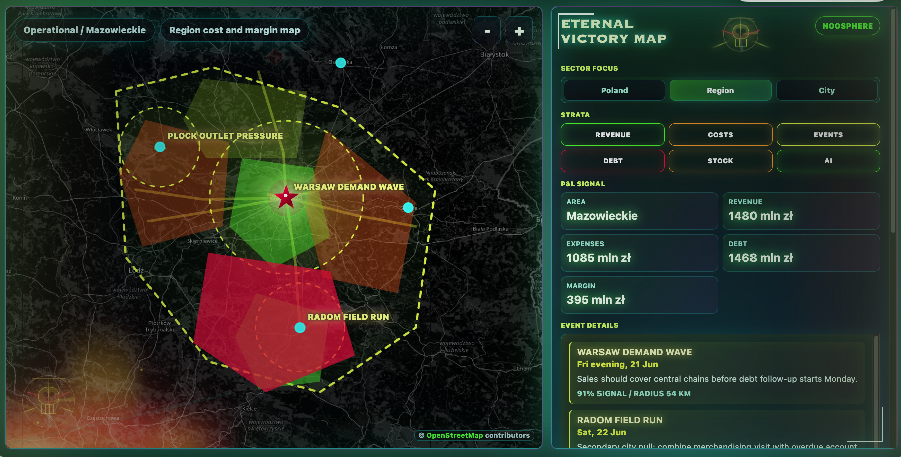
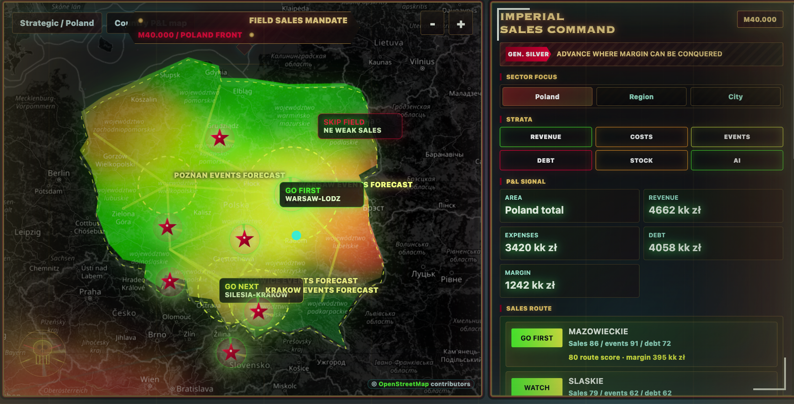
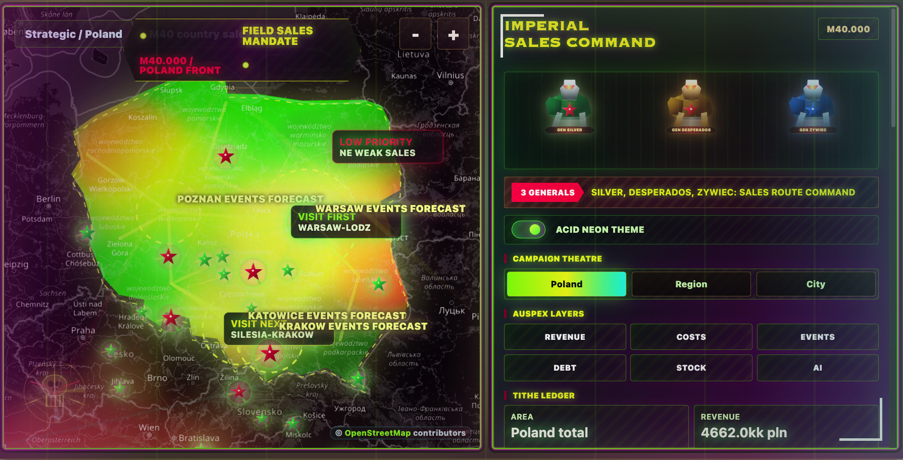

# HEI Neon Map

Leaflet + TypeScript prototype for an offline neon signal map of Poland.

## Run

```bash
npm install
npm run dev
```

The dev server is configured for `http://127.0.0.1:8123`.

## Codex Log

- [Codex chat log](codex.log.md)

## Photos

Full screenshot timeline: [photoes/README.md](photoes/README.md)

| 2026-06-17 15:34:42 | 2026-06-17 15:35:00 |
| --- | --- |
|  |  |

| 2026-06-17 15:51:04 | 2026-06-17 15:57:14 |
| --- | --- |
|  |  |

| 2026-06-17 16:04:13 | 2026-06-17 16:56:50 |
| --- | --- |
|  |  |

## Structure

- `src/main.ts` - Leaflet app, level switching, layer toggles, AI priority scanner.
- `src/mapSvg.ts` - local offline SVG basemap fallback.
- `src/zabkaLayer.ts` - city-level Żabka canvas layer with thousands of points.
- `src/priorities.ts` - AI priority polygons that rotate by region.
- `public/data/demo.json` - demo business signals.

## Geo Data Contract

Export local GeoJSON from the TypeScript demo data:

```bash
npm run export:geo
```

Generated files are written to `public/geo/` with `manifest.json`:

- `public/geo/poland-country.geojson`
- `public/geo/poland-voivodeships.geojson`
- `public/geo/poland-admin-boundaries.geojson`
- `public/geo/highways.geojson`
- `public/geo/poland-transport.geojson`
- `public/geo/poland-signals.geojson`
- `public/geo/poland-events.geojson`
- `public/geo/poland-cities.geojson`
- `public/geo/mazowieckie-region.geojson`
- `public/geo/mazowieckie-signals.geojson`
- `public/geo/mazowieckie-transport.geojson`
- `public/geo/mazowieckie-events.geojson`
- `public/geo/mazowieckie-cities.geojson`
- `public/geo/warsaw-city.geojson`
- `public/geo/warsaw-districts.geojson`
- `public/geo/warsaw-signals.geojson`
- `public/geo/warsaw-transport.geojson`
- `public/geo/warsaw-events.geojson`
- `public/geo/zabka-points.geojson`
- `public/geo/zabka-coverage-hubs.geojson`

Runtime should stay offline: GeoJSON files live in the repo and Leaflet renders them locally.
